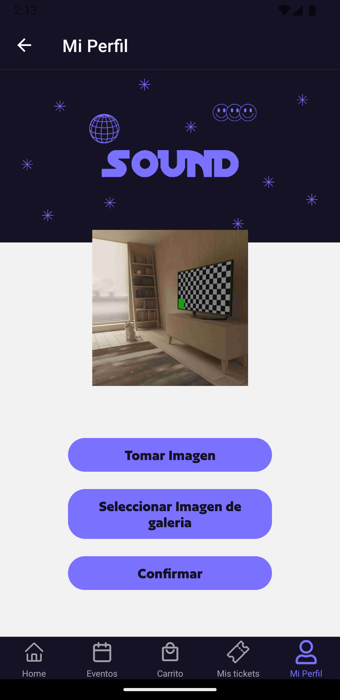

# SOUND

Sound es una aplicación móvil hecha con React Native para comprar tickets a fiestas o eventos de manera segura que permite la posibilidad de llevar tu entrada con vos en el celular sin necesidad de un ticket físico. 

### Registro e inicio de sesión.

Apenas se abre la app se muestra la pantalla para poder registrarte como usuario a través de tu email y una contraseña.
Para iniciar sesión también se usan los mismos datos de registro (email y contraseña)

### Menú de navegación

El manú de navegación esta formado por un Home, Eventos, Carrito de compras, Mis tickets y Mi perfil

#### *Home*

El Inicio muestra las categorias para seleccionar el lugar del evento al que queres asistir y comprar el ticket. Son: Córdoba, Mendoza y Buenos Aires, eligiendo uno va a mostrar la lista de los eventos que producen en el lugar seleccionado.

#### *Eventos*

En la ección de eventos se van a cargar todos los eventos que la app tiene cargada a la venta, con un buscador para poder filtrar el evento que deseas.
Seleccionando un evento se abre el detalle del mismo, en el cual se puede ver una imagen, el nombre del evento, lugar, hora y fecha del mismo, un mapa con las coordenadas del lugar, una breve descripción y distintas opciones de tickets que podes elegir comprar (general, vip, 4x3)

 

#### *Carrito de compras*

En el carrito de compras se va a mostrar una tarjeta con la información del evento que seleccionaste a comprar, cúal es, tipo de entrada, cantidad y costo.
Abajo se mostrarán los datos del total a pagar incluyendo el costo de servicio y un botón para confirmar la compra.
 
 

#### *Mis tickets*

En mis tickets vas a poder ver todos los tickets que compraste. Cada tarjeta tiene un botón para acceder a ver el QR del ticket comprado.
 

#### *Mi perfil*

En el perfil se encuentran los datos que el usuario tiene que llenar para poder completarlo (nombre, apellido y dni). También se puede agregar una foto de perfil que puede seleccionarse desde galeria o sacar una foto. El botón de cerrarsesión se encuentra en el perfil

  